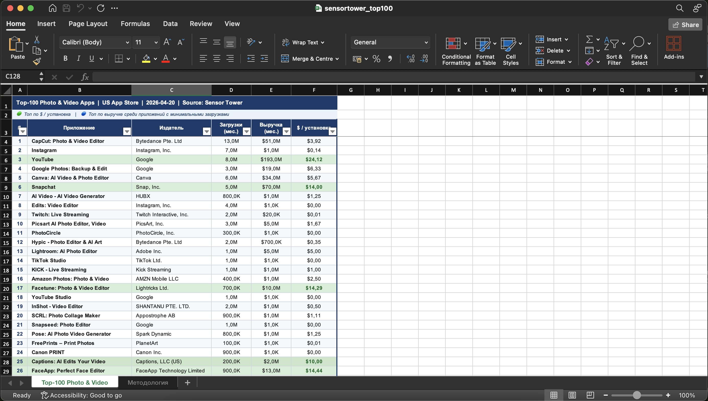

[README.md](https://github.com/user-attachments/files/27216416/README.md)
# Sensor Tower — Top-100 Photo & Video Apps (US App Store)


Скрипт выгружает данные топ-100 приложений категории **Photo & Video** из US App Store через внутренний API Sensor Tower и сохраняет результат в форматированный `.xlsx`-файл с аналитической разметкой.

---

## 🔍 Подход

Страница `app.sensortower.com/top-charts` загружает данные через внутренний API-эндпоинт:

```
GET /api/ios/category_rankings?category=6008&country=US&device=iphone&date=2026-04-20
```

Один запрос возвращает максимум 25 записей — скрипт делает **4 последовательных запроса** с `offset=0, 25, 50, 75` и объединяет результаты в таблицу из 100 строк.

> Никакого парсинга HTML, никакой эмуляции браузера — только прямые HTTP-запросы к API.

---

## 📁 Структура результата

| Колонка | Описание |
|---|---|
| # | Ранг в чарте |
| Приложение | Название |
| Издатель | Компания-разработчик |
| Загрузки (мес.) | Число установок за последний месяц |
| Выручка (мес.) | Выручка от IAP + платных загрузок |
| $ / установка | Выручка ÷ Загрузки |

### Аналитическая разметка

🟢 **Зелёный** — приложения с наибольшим показателем `$ / установка`: наиболее эффективная монетизация

🔵 **Синий** — приложения с наибольшей выручкой среди тех, у кого минимальные загрузки (нижняя треть): высокий заработок при минимальном охвате



---

## ⚙️ Установка и запуск

**1. Установи зависимости:**
```bash
pip3 install requests pandas openpyxl
```

**2. Запусти скрипт:**
```bash
python3 sensortower_top100_final.py
```

**3. Результат** — файл `sensortower_top100.xlsx` появится в той же папке.

### Пример вывода в терминале

```
═══════════════════════════════════════════════════════
  SensorTower Top-100 Photo & Video — US App Store
  Дата: 2026-04-20  |  Чарт: FREE
═══════════════════════════════════════════════════════

📡  Загружаем данные…
  Страница 1/4 (offset=0)…
  Страница 2/4 (offset=25)…
  Страница 3/4 (offset=50)…
  Страница 4/4 (offset=75)…
   Получено: 100 записей

🟢  Топ по $ / установка:
  # 1  YouTube                              dl=8,000,000  rev=$193,000,000  $24.12/install
  # 2  Facetune: Photo & Video Editor       dl=700,000    rev=$10,000,000   $14.28/install
  ...

✅  Сохранено: sensortower_top100.xlsx
```

---

## 🔑 Аутентификация

Sensor Tower требует авторизованной сессии. В начале скрипта укажите актуальные значения `COOKIE` и `CSRF_TOKEN`.

**Как получить:**
1. Открыть страницу чарта в браузере (авторизованным пользователем)
2. `DevTools (F12)` → вкладка **Network** → фильтр **Fetch/XHR** → обновить страницу
3. Найти запрос `category_rankings` → скопировать заголовки `Cookie` и `X-CSRF-Token`

---

## 🛠 Технологии

| | |
|---|---|
| **Язык** | Python 3.8+ |
| **HTTP-запросы** | `requests` |
| **Обработка данных** | `pandas` |
| **Генерация Excel** | `openpyxl` |
| **Источник данных** | Sensor Tower Internal API |
